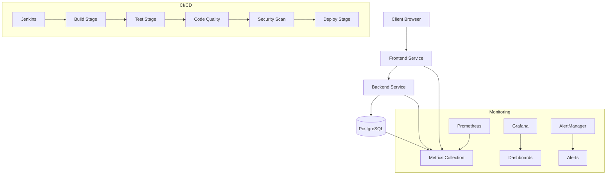
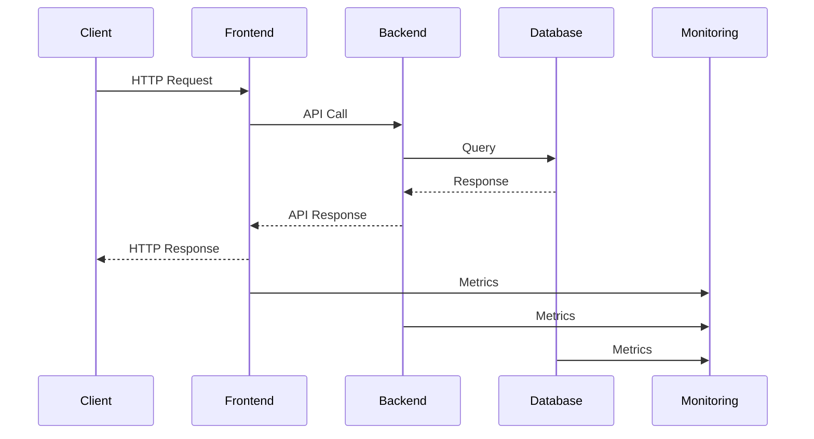
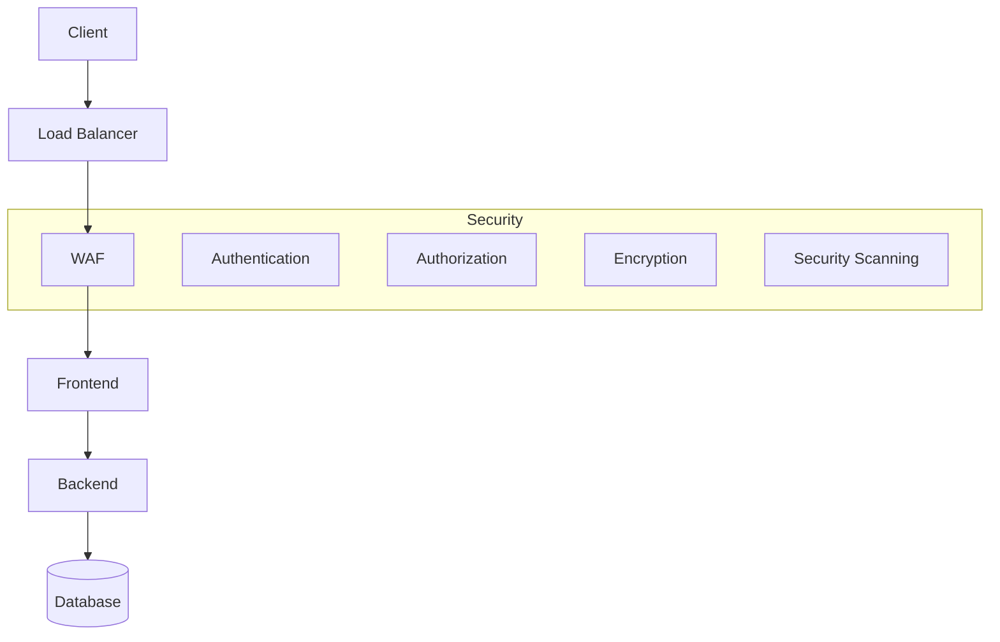
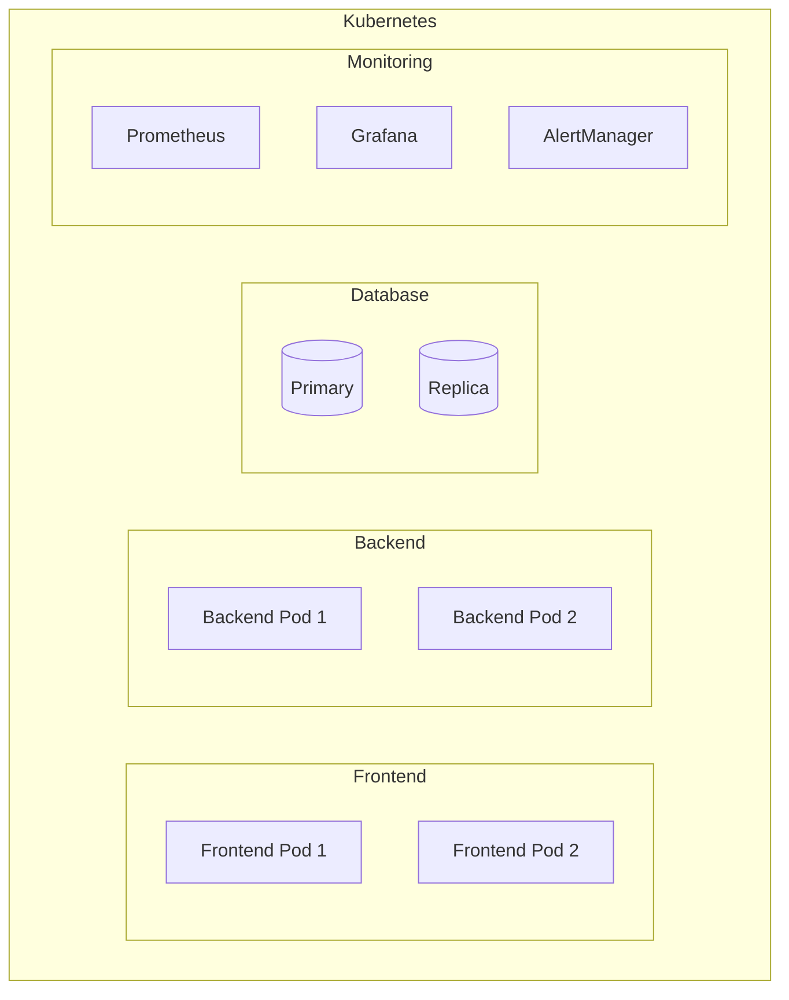

# System Architecture

## High-Level Architecture

## Component Details

### Frontend Service
- **Technology**: React.js
- **Container**: Nginx
- **Port**: 80
- **Health Check**: /health
- **Metrics**: /metrics

### Backend Service
- **Technology**: Spring Boot
- **Container**: OpenJDK
- **Port**: 8080
- **Health Check**: /actuator/health
- **Metrics**: /actuator/prometheus

### Database
- **Technology**: PostgreSQL
- **Version**: 14
- **Port**: 5432
- **Metrics**: pg_exporter

### CI/CD Pipeline
1. **Build Stage**
   - Multi-stage Docker builds
   - Version tagging
   - Artifact storage

2. **Test Stage**
   - Unit tests
   - Integration tests
   - E2E tests
   - Performance tests

3. **Code Quality**
   - SonarQube analysis
   - Code coverage
   - Style checks

4. **Security**
   - Dependency scanning
   - Container scanning
   - SAST/DAST

5. **Deploy**
   - Blue/Green deployment
   - Health checks
   - Rollback capability

### Monitoring Stack
1. **Prometheus**
   - Service monitors
   - Recording rules
   - Alert rules

2. **Grafana**
   - Application dashboards
   - System dashboards
   - Custom visualizations

3. **AlertManager**
   - Alert routing
   - Notification channels
   - Alert grouping

## Data Flow

## Security Architecture

## Deployment Architecture

## Network Architecture
- **Ingress**: Nginx Ingress Controller
- **Services**: ClusterIP for internal communication
- **Load Balancing**: Round-robin with health checks
- **Network Policies**: Pod-to-pod communication rules
- **TLS**: Cert-manager for SSL/TLS termination

## Storage Architecture
- **Database**: Persistent Volume Claims
- **Logs**: Elasticsearch/Fluentd
- **Metrics**: Prometheus storage
- **Artifacts**: Object storage

## High Availability
- **Frontend**: Multiple replicas with anti-affinity
- **Backend**: Multiple replicas with anti-affinity
- **Database**: Primary-Replica setup
- **Monitoring**: Highly available Prometheus setup

## Disaster Recovery
- **Backup**: Regular database backups
- **Restore**: Automated restore procedures
- **Failover**: Automated failover for database
- **Recovery**: Documented recovery procedures 